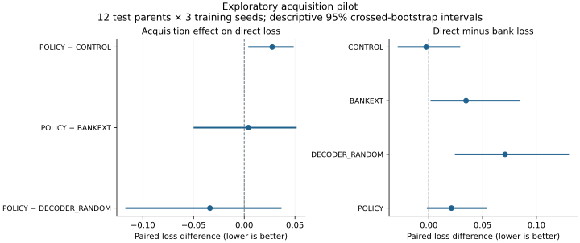

# Exploratory controlled-acquisition pilot

This completed run is an exploratory measurement, not a confirmatory paper
result. It used 60 fresh logical parents, three training seeds, 120 records,
3–5 logical qubits, at most 10 physical qubits, one embedding variant, one
chain strength and two runtimes. Twelve parents (24 records) were held out.
The summary encoder had width 32 and eight proposals; training allowed 75
epochs with patience 15. All settings were frozen before these test outcomes.

## Observed result

POLICY did not demonstrate an advantage over both matched acquisition controls.
Its direct loss exceeded CONTROL in each of the three seeds. Lower loss is
better; positive differences below favour the comparator.

| Direct-loss contrast | Mean difference | Descriptive 95% crossed CI |
|---|---:|---:|
| POLICY minus CONTROL | +0.027589 | [0.003945, 0.048748] |
| POLICY minus BANKEXT | +0.004107 | [-0.049999, 0.051680] |
| POLICY minus DECODER-RANDOM | -0.033806 | [-0.117216, 0.036702] |

These intervals are unadjusted and conditional on the fixed training population,
hyperparameters and random acquisition designs. Three seeds give limited
information about optimization variability. The pilot does not reproduce the
larger historical study and cannot refute or confirm its one-seed result by
itself. It does prevent claiming that the current relabelling recipe is already
a demonstrated improvement under controlled conditions.

Original validation-bank regret selected POLICY checkpoints at epochs 3, 2, 2,
versus 43, 20, 20 for CONTROL (zero-based). That difference suggests checkpoint
selection is a useful next ablation, but does not establish its causal role.
Changing selection after this result requires validation-only development and a
fresh held-out evaluation; this pilot must remain unchanged.



## Work and artifacts

- 15 completed fits: three frozen baselines and four retraining arms per seed.
- 5,184 added-label simulator calls; no acquisition failures.
- 4,608 offline proposal-diagnostic calls, separate from deployment.
- Both bank and direct deployment used zero online simulator calls.
- The initial dataset additionally contained 1,920 candidate outcomes. Internal
  propagation/refinement work is larger and appears in the full cost ledger.

`study.json` contains the frozen recipe, environment, source fingerprint and
checkpoint/acquisition/evaluation hashes. `dataset_manifest.json` retains the
parent split and record fingerprints. `contrasts.json` is a compact result and
cost index. `summary.json.gz` preserves the complete unmodified 9.6 MB summary,
including individual held-out rows, all-proposal outcomes, fixed-proposal critic
comparisons and latency samples. Its uncompressed SHA-256 is in `contrasts.json`.
Checkpoints and generated training records can be regenerated from the frozen
configuration; they are not committed as model weights.

Reproduce from the source revision with fingerprint
`a07e7a1ff339c0428b4df7582fc36a9304cecb575b40729ae915ba206779c84d`:

The archived run's source is preserved in GitHub commit
[`cb1f565`](https://github.com/hydrogen1999/anneal_control/commit/cb1f565d01b77431ea2aa781a8a2827e5160ac2f).
Later commits harden retry accounting and integrate newer upstream modules;
they have a different source fingerprint and cannot resume this old run silently.

```bash
python -m annealctrl acquisition-study --config configs/acquisition_pilot.json --output runs/pilot_reproduction
python scripts/plot_acquisition_study.py --summary reports/acquisition_pilot_2026-09-17/summary.json.gz --output runs/pilot_plot.svg --title 'Exploratory acquisition pilot'
```

Hardware timings are environment-specific; reruns need not reproduce wall times
or byte-identical data manifests containing timing fields. Preserve the
negative result when presenting this revision.
